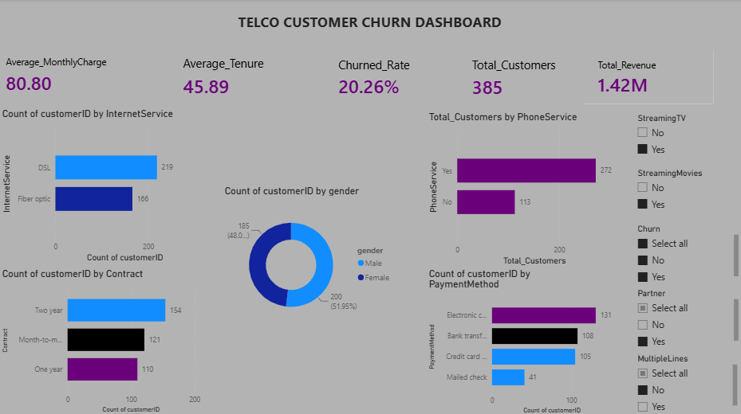

# CUSTOMER-CHURN-ANALYSIS
## Project Overview
This is Telco churn customer dataset gotten from kaggle , it contains 7032rows 21columns with names of columns as Gender Senior Citizen  Partner Dependents  Contract Monthly Charges Total Charges Tenure Internet Service Payment Method Churn. The analysis includes data inspection, missing value assessment, descriptive statistics, visualization, and business insight generation.

---

## Objectives

* Explore the structure of the dataset.
* Assess data quality and missing values.
* Generate descriptive statistics.
* Visualize customer demographics and service usage.
* Identify patterns associated with customer churn.
* Produce actionable business insights.

---

## Dataset

**Dataset:** Telco Customer Churn

The dataset contains customer demographic information, subscribed services, contract details, billing information, tenure, and churn status.

Main features include:

* CustomerID
* Gender
* SeniorCitizen
* Partner
* Dependents
* Tenure
* PhoneService
* InternetService
* Contract
* PaymentMethod
* MonthlyCharges
* TotalCharges
* Churn

---

## Tools Used

* Python
* Pandas
* NumPy
* Matplotlib
* Seaborn
* Jupyter Notebook
* MySQL
* PowerBI

---

## Exploratory Data Analysis

The project includes:

* Dataset overview
* Data types inspection
* Missing value assessment
* Summary statistics
* Distribution analysis
* Correlation analysis
* Customer segmentation
* Churn analysis
* Trend identification

---

## Visualizations

The following visualizations were created:

* Bar Charts
* Pie Charts
* Histograms
* Line Charts
* Correlation Heatmap
* Box Plots
* Scatter Plot
* Count Plots

---
## Power BI Dashboard



## Key Insights

* Most customers remained with the company, while a significant proportion churned.
* Customers on Month-to-Month contracts experienced the highest churn rates.
* Longer-tenure customers generally accumulated higher total charges.
* Higher monthly charges were associated with increased churn.
* Contract type and tenure appeared to be strong indicators of customer retention.
* Electronic check was one of the most common payment methods among customers who churned.

---

## Repository Structure

```text
data/
images/
notebook/
powerbi/
sql/
README.md
requirements.txt
LICENSE
```

## Business Recommendations

•	Give more promo to the monthly subscribers, adding 3 months plan together and giving a discount.
•	Pricing shout be reviewed, the fees for the plans are not encouraging.
•	Some services which will not cost the company much expense should be free, like support , security e.t.c every customer should have these automatically in their plans.
•	Always show the customers that has longer tenure that their trust is appreciated by giving discounts regularly.


---

## Author

**Oghenefegor Annabel Ogbe**

Aspiring Data Analyst passionate about using Python, SQL, Excel, Power BI, and Tableau to transform data into actionable business insights.
